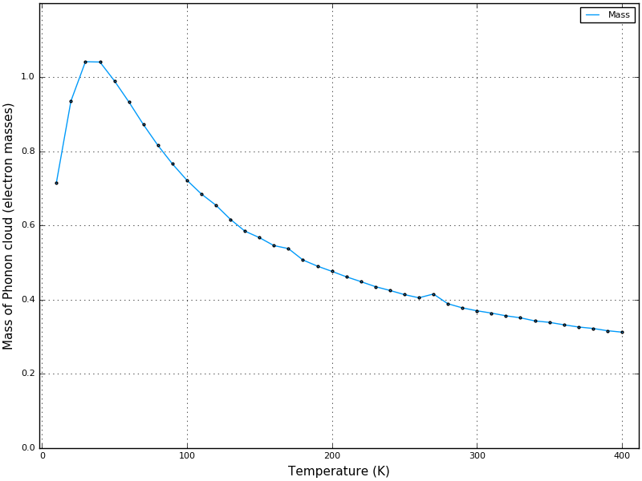
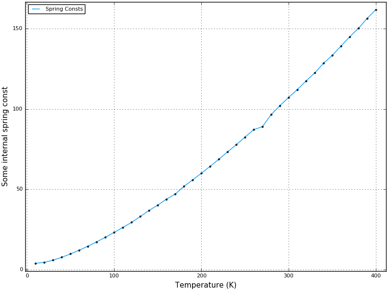

# PolaronMobility-FeynmanKadanoffOsakaHellwarth

[](https://travis-ci.org/jarvist/PolaronMobility.jl)
[](https://coveralls.io/github/jarvist/PolaronMobility.jl?branch=master)
[](http://codecov.io/github/jarvist/PolaronMobility.jl?branch=master)

These codes calculate the temperature-dependent polaron mobility for
a material.
We have parameters for various metal-halide Perovskite.

More extensive documentation is available
[](https://jarvist.github.io/PolaronMobility.jl/),
which is perhaps easiest to read and understand alongside the pre-print:
[ArXiv:1704.05404](https://arxiv.org/abs/1704.05404) .

The required inputs are the dielectric constants (ϵ-static and ϵ-optic)
, a characteristic phonon frequency (ω), and the bare-electron band
effective-mass (me).  These values can be relatively easily calculated in the
ab-initio electronic structure package of your choosing, or measured directly. 

From these four values, the code solves a temperature-dependent polaron model. 
This is done by variationally optimising the temperature-dependent free-energies for the coupled
electron-phonon system. 
These optimised parameters describe the polaron with the infinite quantum field
of lattice vibrations 'integrated through', and replaced with a phonon-drag
term. 
From this the polaron features such as effective-mass, size of the
wavefunction, frequency of energy oscillation etc. can be calculated. 

This polaron state can then be used as an input to further models for polaron
mobility. 

The codes are designed to produce a set of temperature-dependent mobilities and
other data, for direct incorporation into a scientific publication. 

May your phonons drag in a manner truly sublime.


## Installation

These codes require Julia >0.6 . They are structured as a full Julia package, but are not yet registered with the central METADATA package repository. 

To install, type the following at the Julia REPL:

```
julia> Pkg.clone("git://github.com/Jarvist/PolaronMobility.jl.git")
```

## Research outputs

As an example, here are some indicative figures generated by the code. 

Polaron mobilities, three different ways


Effective mass of phonon cloud


Spring constant for coupling to phonon cloud


Variational (temperature-dependent free-energy) parameters for the coupled system


