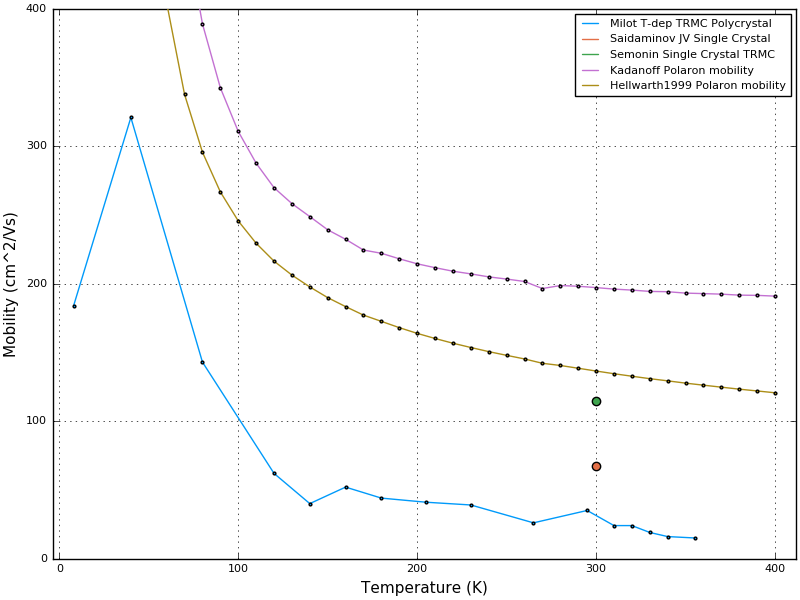

# PolaronMobility.jl

[](https://travis-ci.org/jarvist/PolaronMobility.jl)
[](https://coveralls.io/github/jarvist/PolaronMobility.jl?branch=master)
[](http://codecov.io/github/jarvist/PolaronMobility.jl?branch=master)
[](https://jarvist.github.io/PolaronMobility.jl/)

[](https://doi.org/10.21105/joss.00566)

`PolaronMobility.jl` is a Julia package which calculates the
temperature-dependent polaron mobility for a material. 

This is based on the Feynman variational solution to the Polaron problem. 
The electron-phonon coupling is treated as an effective α (alpha) Frohlich
Hamiltonian parameter. 
The band structure is treated with an effective mass theory. 
The variational problem is solved numerically for finite-temperature free
energies. 
(The original 1960s work, and thus textbook solutions, often use asymptotic approximations to the integrals, with a more simple athermal action.)   
The mobility is calculated in three ways:
1) numerically by integrating the polaron self-energy along the imaginary axis (`Hellwarth1999`)
2) using the Kadanoff Boltzmann equation approximation (`Kadanoff1963`)
3) using the FHIP low-temperature asymptotic solution (`FHIP`)

These three methods are in approximately descending order of accuracy. 

We provide parameters for various metal-halide Perovskites, and other
interesting systems.

The motivation for developing these codes was to enable polaron mobility
calculations on arbitrary materials. 
They also provide the only extant implementation of Feynman's variational
method.  
They offer a convenient basis for writing codes that build on these variational
solutions. 

More [extensive documentation](https://jarvist.github.io/PolaronMobility.jl/),
is perhaps easiest to read and understand alongside the first paper:
[ArXiv:1704.05404](https://arxiv.org/abs/1704.05404)
/ [Frost2017PRB](https://doi.org/10.1103/PhysRevB.96.195202).


## Local installation

These codes require Julia >0.6 . They are structured as a full Julia package,
but and are registered with the central METADATA package repository. 

To install, type the following at the Julia REPL:

```
julia> import Pkg; Pkg.add("PolaronMobility")
```

### Common errors

Often errors discoverd when trying to run these codes are related to changes in the interface to [`Optim.jl`](https://github.com/JuliaNLSolvers/Optim.jl)

This general appears as a MethodError with the internal Optim type, perhaps similar to:
`MethodError: Cannot convert an object of type Optim.BFGS{...`

You may want to check the Optim package version and status:
`Pkg.status("Optim")`

The present versions of the code require `Optim 0.15-`.

## Polarons in the cloud

There is an [example notebook](JuliaBox-Example.ipynb) which can be run interactively on the (free) MyBinder notebook server. This is the fastest way to calculate a few polaron parameters, if you do not have Julia.

1) Click on [](https://mybinder.org/v2/gh/jarvist/PolaronMobility.jl/master?filepath=JuliaBox-Example.ipynb)
2) That's it!

(Currently plotting does not work, as the Docker image is not built with the (heavy weight) Plots dependency, and I'm not sure how I can do this just for MyBinder, without requiring it generally for PolaronMobility.jl. If this is problematic for you, please open an issue and I'll try to fix it!)

## Using

As an example:

```
using PolaronMobility
MAPIe=polaronmobility(300, 4.5, 24.1, 2.25E12, 0.12)
```

Will calculate the polaron mobility for methyl-ammonium lead halide perovskite
(f=2.25 THz; ϵoptical=4.5; ϵstatic=24.1; effective-mass=0.12 electron-masses) at 300 K. 

An abbreviated output should look like:
```
T: 300.000000 β: 2.41e+20 βred: 0.36 ħω  = 9.31 meV     Converged? : true
 VariationalParams v= 19.86  w= 16.96   ||   M=0.371407 k=106.835753    
 POLARON SIZE (rf), following Schultz1959. (s.d. of Gaussian polaron ψ )
     Schultz1959(2.4): rf= 0.528075 (int units) = 2.68001e-09 m [SI]
 Polaron Free Energy: A= -6.448815 B= 7.355626 C= 2.911977 F= -3.818788  = -35.534786 meV
Polaron Mobility theories:
    μ(FHIP)= 0.082049 m^2/Vs    = 820.49 cm^2/Vs
     Eqm. Phonon. pop. Nbar: 2.308150 
    μ(Kadanoff1963 [Eqn. 25]) = 0.019689 m^2/Vs      = 196.89 cm^2/Vs
    Tau=1/Gamma0 = 1.15751e-13 = 0.115751 ps
    μ(Hellwarth1999)= 0.013642 m^2/Vs   = 136.42 cm^2/Vs
```

Further details in the
[documentation](https://jarvist.github.io/PolaronMobility.jl/).

## Research outputs

The central output of this model are temperature-dependent polaron mobilities: 



From the variational solution, you have characterised the polarons in your
system. 
This gives access to the effective mass renormalisations (phonon drag), polaron
binding energies, effective electron-phonon coupling parameters, etc.

## Community guidelines

Contributions to the code (extending that which is calculated), or additional
physical systems / examples, are very welcome. 

If you have questions about the software, scientific questions, or find errors,
please create a [GitHub issue](https://github.com/jarvist/PolaronMobility.jl/issues). 

## Reference

If you find this package (or snippets, such as the entered and tested
free-energy expressions) useful for your work, please cite the paper 
[Frost2017PRB](https://doi.org/10.1103/PhysRevB.96.195202). 

```
@article{Frost2017,
  doi = {10.1103/physrevb.96.195202},
  url = {https://doi.org/10.1103/physrevb.96.195202},
  year  = {2017},
  month = {nov},
  publisher = {American Physical Society ({APS})},
  volume = {96},
  number = {19},
  author = {Jarvist Moore Frost},
  title = {Calculating polaron mobility in halide perovskites},
  journal = {Physical Review B}
}
```

These codes use the `Optim.jl` optimisation library to do the essential calculation of the Feynman variational theory. 
[](https://doi.org/10.21105/joss.00615)

